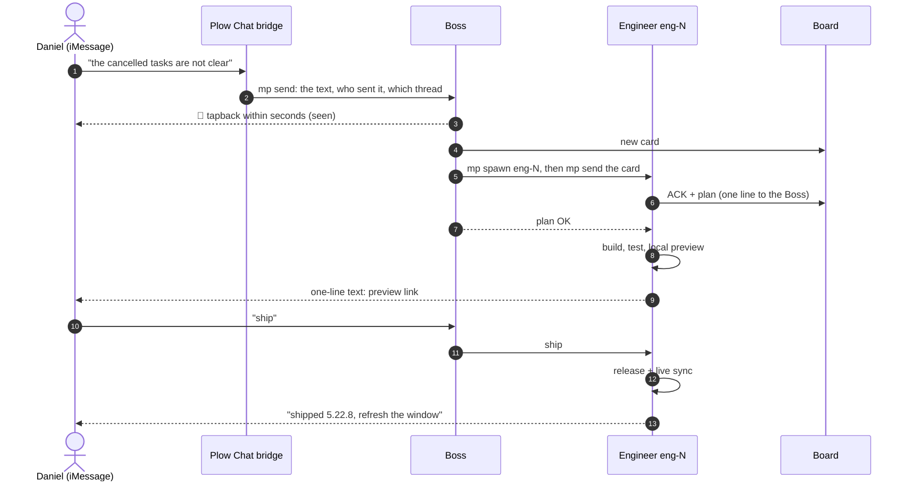
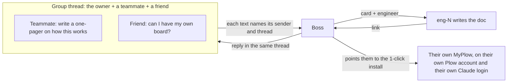
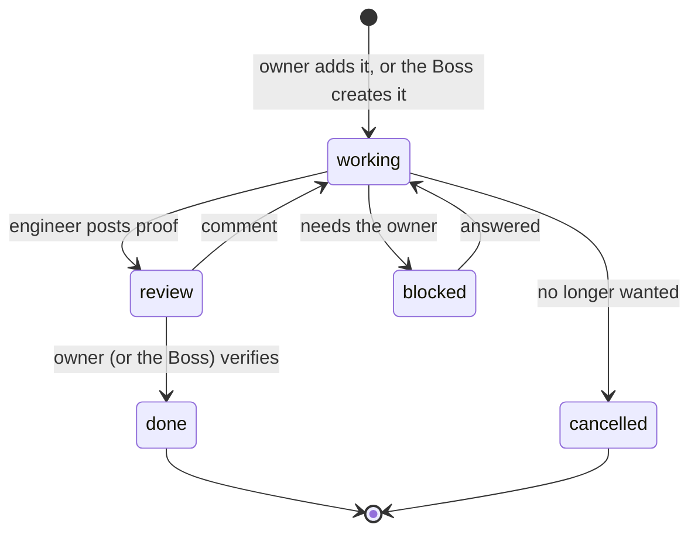
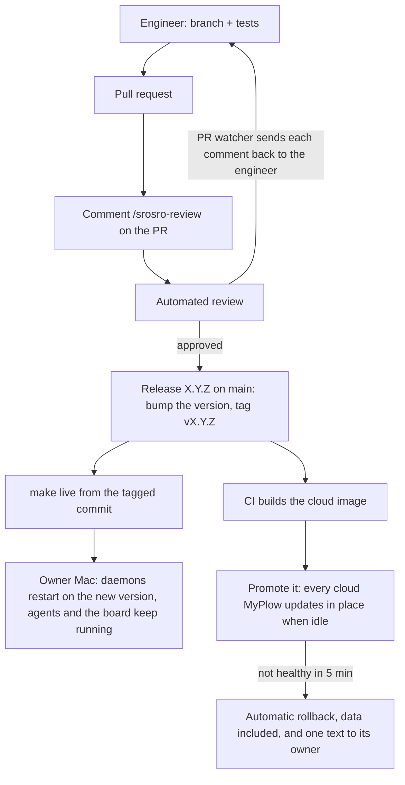

# How MyPlow works

MyPlow is a self-hosted team of AI coding agents (Claude Code, Codex or Grok) with one persistent
**Boss** in charge. Daniel runs his whole team from his phone: he texts the Boss like he would text a
person, watches the work on a priorities **Board**, and says "ship" when a change looks right. This
page shows the interaction patterns behind that.

## The cast

| Piece | What it is |
| --- | --- |
| **The owner** | Daniel. He texts from iMessage and opens the MyPlow app (Board + Graph) on his Mac. |
| **Plow Chat bridge** | The `plow-chat` plugin. Every few seconds it reads the owner's Plow messaging line, hands each new text to the Boss, and sends the Boss's replies back into the same thread. |
| **Boss** | One long-lived agent (`main:Boss`). It plans, routes and verifies. It answers small things itself and hands real work to engineers. |
| **Engineers** | Agents named `eng-N`, each in its own terminal, each owning one card. They are started with `mp spawn` and talked to with `mp send`. |
| **Board** | The priorities, one card per piece of work. It is the source of truth: the owner adds and comments here, and engineers post plans, progress and proof here. |
| **Graph** | The live fleet: every agent's terminal under the Boss. Click one to take it over. |
| **PR watcher + reviewer** | Engineers open PRs and post `/srosro-review` to get an automated review; the watcher delivers every review comment back to the engineer whose card links that PR. |

## The everyday loop

The owner never manages agents directly. He says what he wants, and gets one-line answers back.

What makes this work for the owner:

- **👀 first.** Every text the bridge hands to an agent starts with one instruction: tapback the
  message 👀 before reading on. The sender knows within seconds that it was seen; the answer comes
  when the work does.
- **One line back.** Texts to the owner are a single line, with times in his time zone. Detail lives
  on the card, not in his messages.
- **He decides, agents route.** The Boss delivers his words to the engineer unchanged and adds
  nothing of its own; engineers bring decisions to the Boss, not to him.
- **He sees it before it ships.** A change to how the product looks or behaves is shown to him
  running (a read-only preview over his live data) before any release.

## Groups

The owner can add his Plow line to a group thread. Each group is its own chat: the Boss is told who
said what, and answers in the thread that asked.

- A tapback from a person never wakes the Boss. It rides along with the next real text, labelled as
  an earlier tapback, so it is never mistaken for that text.
- Nobody else ever runs on the owner's agents or the owner's AI plan. A friend who wants a board gets
  their own copy, which asks them for their own Claude login by text the first time it starts.

## A card's life

A comment the owner leaves on a card goes **straight to that card's engineer**, word for word; the
Boss gets a copy so it can follow along. Engineers answer on the card.

## Ship: review, release, live

- **Only a tagged release reaches the live install.** `make live` refuses any commit that is not the
  tag for its version, and refuses uncommitted changes, so what runs on the owner's Mac is always a
  release you can name.
- **Verified, not assumed.** After a release the engineer checks the files on disk match the tag and
  the running server serves the new behaviour, then texts the owner one line.

## Where to look

| To see | Open |
| --- | --- |
| What everyone is working on | The Board (`http://localhost:9933`) |
| Every agent's live terminal | The Graph (the Board's top-right switch) |
| Who is up, from a shell | `mp status` |
| How a text becomes a Boss message | `mypeople/runtime/plugins/plow-chat/plow-chat.py` |
| The Boss's rules | `mypeople/runtime/roles/personalities/boss/` |
| The cloud version | `cloud/` and the README's cloud section |
